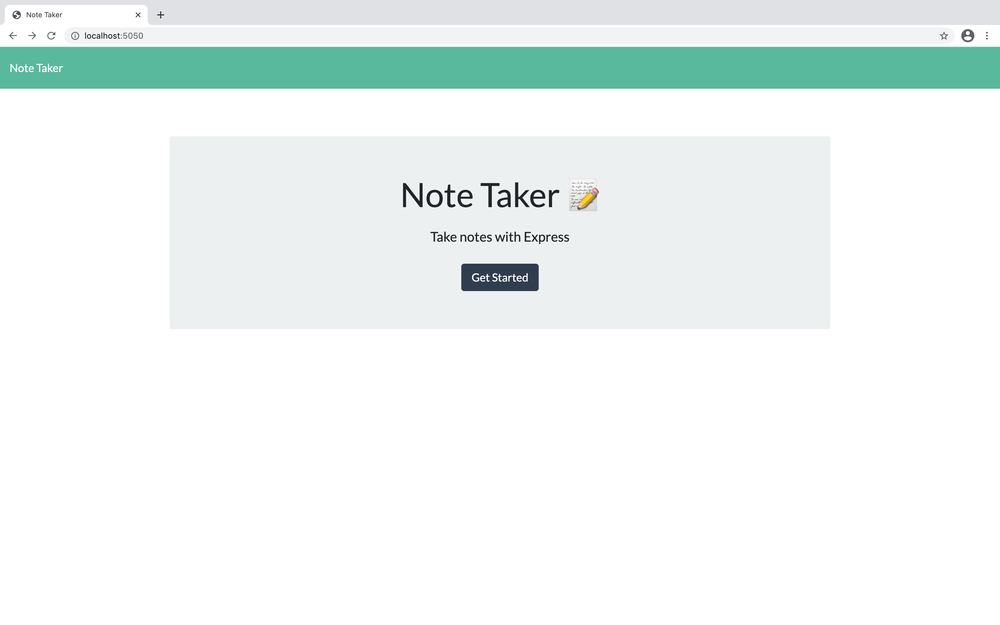
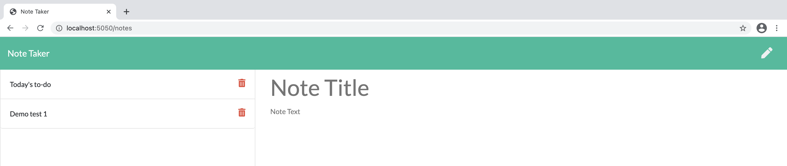

# My Project Name: BC11-Note-Taker
 Unit 11 Express Homework: Note Taker
 ````
## Project Description
The application can be used to write, save, and delete notes. This application will use an express backend and save and retrieve note data from a JSON file.
````
````
## Table of Content
* [Installation](#installation) 
* [Tests](#Tests)
* [Questions](#Questions)
* [License](#License)   
````
````
## Installation
* npm init
* npm install express.js
````
##
## On Heroku (Url)
````Index
* [https://pure-wildwood-00601.herokuapp.com](https://pure-wildwood-00601.herokuapp.com)
````
````Notes
* [https://pure-wildwood-00601.herokuapp.com/notes](https://pure-wildwood-00601.herokuapp.com/notes)
````
##
## Tests

##


````
## Questions
For any questions, please reach out to me:
    Find me in GitHub: josesanchezcapo | [My GitHub Profile](josesanchezcapo) | [Email Me](Follow me in Github to obtain my email.)
## Lincense
* MIT License
````